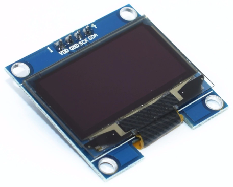
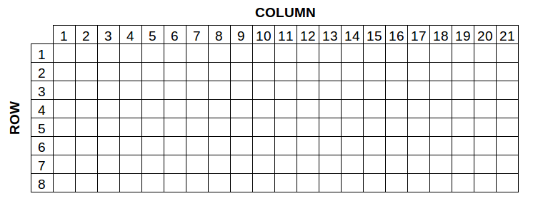
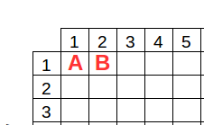
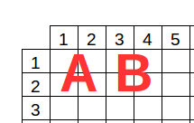
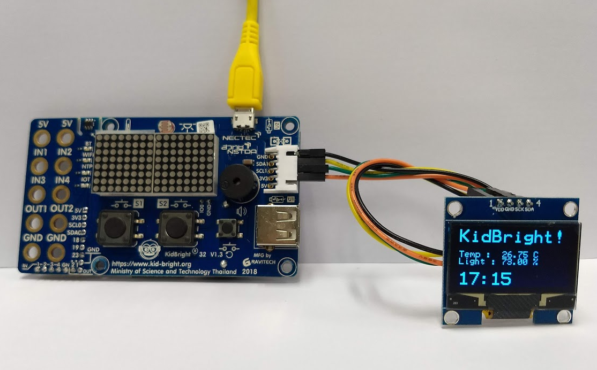
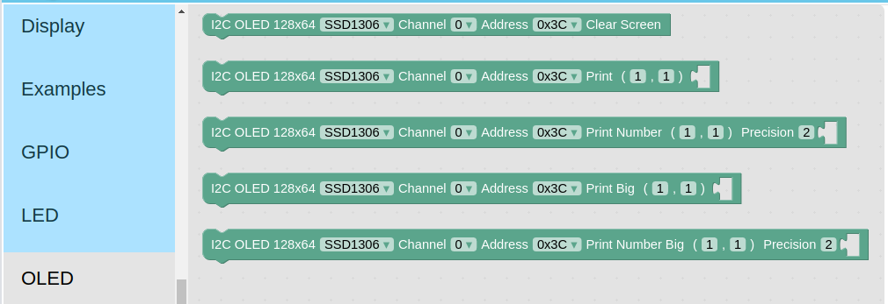
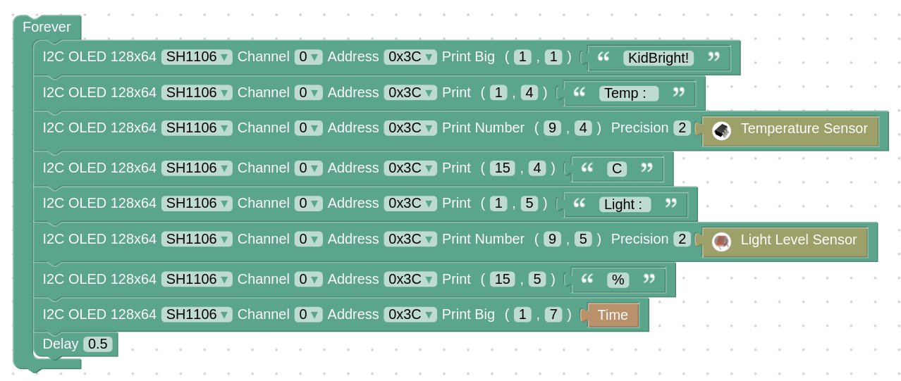

# OLED 128x64 I2C plugin

### จอภาพแบบ OLED
- รองรับชิพเซ็ต SSD1306 และ SH1106
- จำนวนพิกเซล 128x64
- การเชื่อมต่อแบบ I2C

### ขนาดฟอนต์
- ขนาดปกติ 6x8
- ขนาดใหญ่ (Big) 12x16

### การอ้างอิงตำแหน่งคอลัมน์และแถว
- คอลัมน์ (X) ตั้งแต่ 1 ถึง 21
- แถว (Y) ตั้งแต่ 1 ถึง 8
- ฟอนต์ขนาดปกติใช้จำนวนช่อง 1 ช่อง
- ฟอนต์ขนาดใหญ่ใช้จำนวนช่องเป็น 2 เท่าของขนาดฟอนต์ปกติ

- ฟอนต์ขนาดปกติ ตัวอักษร A อยู่ที่ คอลัมน์ที่ 1 แถวที่ 1
- ฟอนต์ขนาดปกติ ตัวอักษร B อยู่ที่ คอลัมน์ที่ 2 แถวที่ 1

- ฟอนต์ขนาดใหญ่ ตัวอักษร A อยู่ที่ คอลัมน์ที่ 1 แถวที่ 1
- ฟอนต์ขนาดใหญ่ ตัวอักษร B อยู่ที่ คอลัมน์ที่ 3 แถวที่ 1
- จุดอ้างอิงของคอลัมน์ และแถวของฟอนต์ขนาดใหญ่อยู่ที่มุมบนด้านซ้าย

### การต่อใช้งานจาก KidBright I2C Chain ไปยังจอภาพ OLED
- กราวด์ (GND) (สายไฟสีดำ) ต่อไปยังขา GND
- SDA1 (สายไฟสีเหลือง) ต่อไปยังขา SDA
- SCL1 (สายไฟสีเขียว) ต่อไปยังขา SCK
- แรงดัน 3.3 โวลต์ (3V3) (สายไฟสีส้ม) ต่อไปยังขา VCC

### บล๊อก
- หมวด OLED
- บล๊อก Clear Screen สำหรับสั่งล้างหน้าจอ
- บล๊อก Print สำหรับแสดงตัวอักษรบนจอภาพด้วยฟอนต์ขนาดปกติ
- บล๊อก Print Big สำหรับแสดงตัวอักษรบนจอภาพด้วยฟอนต์ขนาดใหญ่
- บล๊อก Print Number สำหรับแสดงตัวเลขบนจอภาพแบบกำหนดจำนวนจุดทศนิยม

### ตัวเลือกในบล๊อก
- ชิพเซ็ต SSD1306 หรือ SH1106
- ช่องที่ต่อจอภาพบน I2C Chain ปกติเป็นช่อง 0
- แอดเดรส I2C ของจอภาพ OLED ปกติเป็น 0x3C
- คอลัมน์และแถว
- ข้อความหรือค่าที่ต้องการแสดง

### ตัวอย่างโปรแกรม

